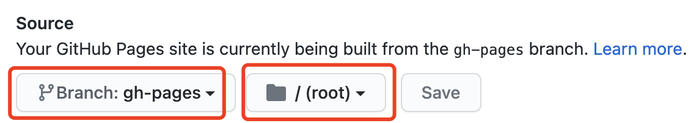

+++
title = "极速搭建个人博客环境"
description = ""

[taxonomies]
tags = ["General"]
categories = ["Blog"]
+++

本文提供了一种 **极速** **零门槛** 搭建舒适的个人博客开发环境的方法.

<!-- more -->

## 概述

### 功能

- 静态博客
- 支持评论
- 支持文章标签
- 支持版本控制
- Markdown编写
- 第三方托管

### 选型

- zola: Rust编写的静态网站生成器, 支持功能较为丰富
- utterances: 基于Github Issue的博客评论插件
- github pages: Github静态网站托管服务
- VS Code Markdown插件: Markdown All in One + Markdown Preview Enhanced

## 流程

### zola创建博客仓库

在github上创建一个权限为public的个人仓库, 将其clone到本地.

在本地安装zola, mac推荐使用brew安装: `brew install zola`.

安装完成后, 在个人仓库中执行 `zola init` 初始化zola. 需要注意, zola必须在空目录下才能init成功, 如果仓库中包含README.md, 则会init失败. 这时, 需要在其他目录执行zola init后, 把这些文件再移动到个人仓库中.

init成功后的目录结构如下所示:

```bash
.
├── config.toml # zola配置文件
├── content # 博文md文件
├── sass # CSS扩展
├── static # 全局静态资源
├── templates # 模板文件
└── themes # zola主题
```

这时执行 `zola serve` , 应该就可以在`http://127.0.0.1:1111`看到zola默认欢迎页了.

注意, 生成的静态html文件位于 `public` 目录下, 需要将该目录添加到.gitignore中, 避免提交到git仓库.

### 安装主题

作为博客系统, 我们希望页面简洁, 功能完备即可. zola提供了一些自带的和第三方的主题 ([点击查看](https://www.getzola.org/themes/)), 经过筛选, 我们选择了自带的even主题.

zola的主题的安装过程非常简单: 将主题仓库作为submodule放到themes文件夹, 然后在config.toml中进行配置即可.

安装主题命令:

```bash
cd themes
git submodule add https://github.com/getzola/even themes/even
```

even主题自带 `目录` 和 `标签` 功能. 只需要在config.toml中进行配置, 改动如下:

```bash
theme = "even"
# theme = "anpu"
taxonomies = [
    { name = "categories", rss = true },
    { name = "tags", rss = true },
]

[extra]
even_title = "My Blogs" # 主页左上角的名称
even_menu = [
    {url = "$BASE_URL", name = "Home"},
    {url = "$BASE_URL/categories", name = "Categories"},
    {url = "$BASE_URL/tags", name = "Tags"},
    {url = "$BASE_URL/about", name = "About"},
]
```

even主题对文章的目录结构有一定的限制, 建议使用以下目录结构:

```bash
.
├── 2021-02-15_testing # 一篇博文的目录, 以日期作为前缀, zola可自动识别并进行排序
│   ├── index.md # 博文内容
│   └── icon.png # 博文相关图片等资源也放在同一目录下, 不要放在static目录中
├── _index.md # content section元数据
└── pages
    ├── _index.md # pages section元数据
    └── about.md # about页面内容
```

_index.md用于设置section的元数据 ([点击查看](https://www.getzola.org/documentation/content/section/)), 对even主题来说, 配置基本的date排序规则和分页即可保证功能正常使用.

`2021-02-15_testing` 目录是我们创建的用于测试的一篇博文.

### 支持文章评论

经过基本的调研, 我们选择utterances作为文章评论插件.

utterances是一个基于Github Issue的评论插件, 每篇文章对应一个Issue评论区, Issue中的Comment即作为文章的评论. 通过OAuth, 登录Github账号即可对文章进行评论.

even主题默认没有提供文章评论服务, 但zola具备扩展主题的能力 ([点击查看](https://www.getzola.org/documentation/themes/extending-a-theme/)), 直接将utterances生成的js代码对page.html的 `page_before_footer` 块进行扩展即可. 相关改动如下:

```bash
# 创建templates/page.html文件, 加入以下内容
# 以下这段代码是utterances官网生成的


<div class="post-comment">
  <script src="https://utteranc.es/client.js"
    repo="eastfisher/blg" # 这里改成你的{github用户名}/{github仓库名}
    issue-term="pathname"
    label="Comment"
    theme="github-light"
    crossorigin="anonymous"
    async>
  </script>
</div>

```

至此, 我们的博客已经基本搭建好了. 在本地再次执行 `zola serve` 看一看效果.

### 在Github部署博客

本地搭建好博客框架, 编辑博文内容后, 我们还需要将其托管到第三方服务, 使之能够在网上被其他人浏览. 我们选择在Github部署博客.

这一步我们需要做两件事: 使用Github Pages托管博客, 以及使用Github Action自动部署博客.

zola文档中有部署到Github Pages的相关说明 ([点击查看](https://www.getzola.org/documentation/deployment/github-pages/)), 在此就不细说了, 按照文档操作即可, 没什么坑. 注意使用仓库的gh-pages分支作为Github Pages构建分支, 构建目录为根目录.



这一步完成后, 我们将以上的所有改动, 通过 `git push` 推送到远程仓库, 等待Github Action执行成功后, 通过以下路径访问博客主页: `{github用户名}.github.io/{github仓库名}`.

至此, 一个托管到github的静态博客网站就搭建成功了.

### 日常编辑

博客框架搭好了, 日常编辑就很简单了. 对于无其他资源的博客, 可以直接在content目录下创建 `YYYY-mm-dd_文章名.md` 文件, 然后开始写. 对有其他资源的博客, 则在content目录下创建 `YYYY-mm-dd_文章名` 目录, 在目录中创建 `index.md` 文件, 然后开始写. 非常easy.

## 编辑器

zola渲染的源文件是markdown格式, 需要选择一款趁手的markdown编辑器. 专用编辑器有MacDown, MWeb, 全功能编辑器有Sublime Text, Atom, VS Code等, 这里选择我常用的VS Code作为MD编辑器.

打开VS Code, 在Extentions搜索Markdown, 可以找到 `Markdown All in One` 和 `Markdown Preview Enhanced` 这两个插件, 安装之.

`Markdown All in One`用于支持全功能MD编辑, 如语法高亮, 智能检查等. `MPE`则主要用其进行实时渲染.

## 总结

### 优点

相比于第三方博客服务, 这一套技术栈的优点有以下几点:

- 完全免费, 容量无限
- 基于git的强大版本控制能力
- 标准Markdown的所有优点 (所想即所得, 编辑器随便选)
- zola本地调试方便, 主题丰富, 可灵活扩展
- 零成本部署

### 其他tips

- 如果不使用github作为托管服务, 那么评论服务插件也需要更换.
- MWeb的快捷键比VS Code+插件更加易用, 可以考虑使用.

## 参考资料

- 本文配置的博客对应代码仓库: [https://github.com/eastfisher/blg](https://github.com/eastfisher/blg)
- [https://www.getzola.org/](https://www.getzola.org/)
- [https://utteranc.es/](https://utteranc.es/)
- [https://pages.github.com/](https://pages.github.com/)
